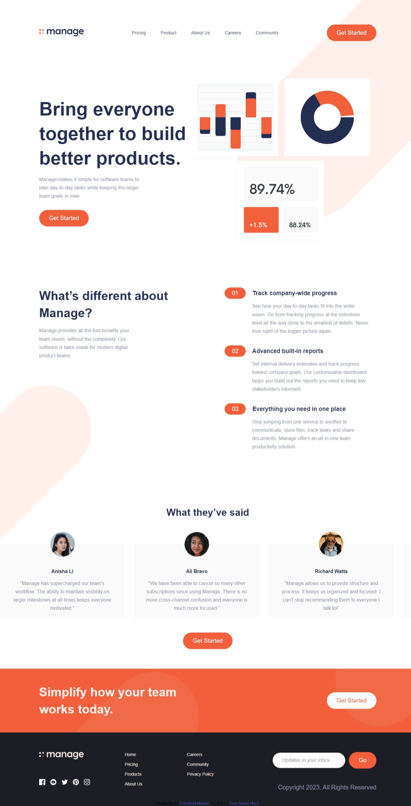

# Frontend Mentor - Manage landing page solution

This is a solution to the [Manage landing page challenge on Frontend Mentor](https://www.frontendmentor.io/challenges/manage-landing-page-SLXqC6P5). Frontend Mentor challenges help you improve your coding skills by building realistic projects.

## Table of contents

- [Overview](#overview)
  - [The challenge](#the-challenge)
  - [Screenshot](#screenshot)
  - [Links](#links)
- [My process](#my-process)
  - [Built with](#built-with)
  - [What I learned](#what-i-learned)
  - [Continued development](#continued-development)
- [Author](#author)

## Overview

### The challenge

Users should be able to:

- View the optimal layout for the site depending on their device's screen size
- See hover states for all interactive elements on the page
- See all testimonials in a horizontal slider
- Receive an error message when the newsletter sign up `form` is submitted if:
  - The `input` field is empty
  - The email address is not formatted correctly

### Screenshot

#### Desktop screenshot



### Links

- Live Site here: [Add live site URL here](https://your-live-site-url.com)

## My process

### Built with

- Semantic HTML5 markup
- CSS custom properties
- Flexbox

### What I learned

How to use css pseudo-classes.
How to do a flexslider in JavaScript.
Plain Javascript simple form validation

```css
.app__footer section section ul li:not(:last-child){
  margin-bottom: 1rem;
}
```

### Continued development

For now am doing more projects that involve some `JS` to enhance my skills in `Js`. Also do more work on my `CSS` skills as I think that i write alot of `CSS` code in my projects though i try to make them be responsive as much as possible and look amazing on diffrent screen sizes.

## Author

- Frontend Mentor - [@Angwenyiogata](https://www.frontendmentor.io/profile/Angwenyiogata)
